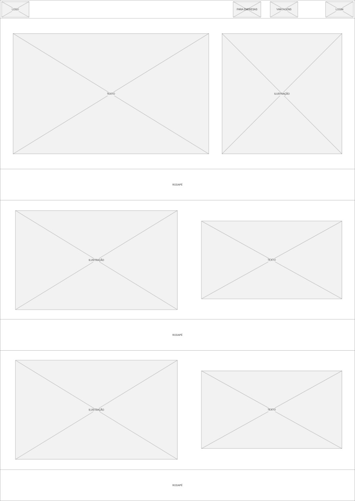
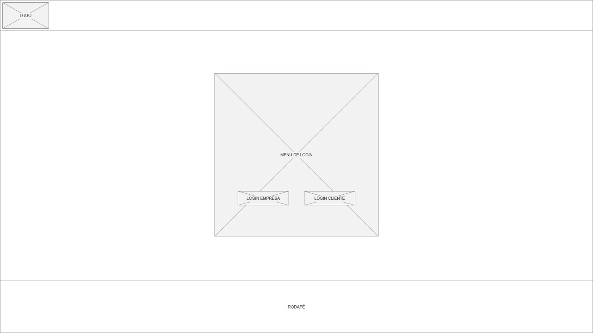
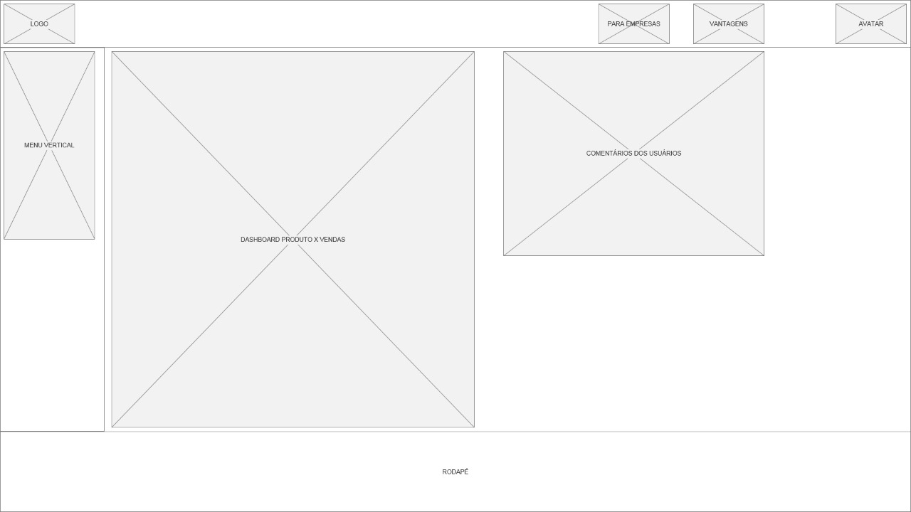
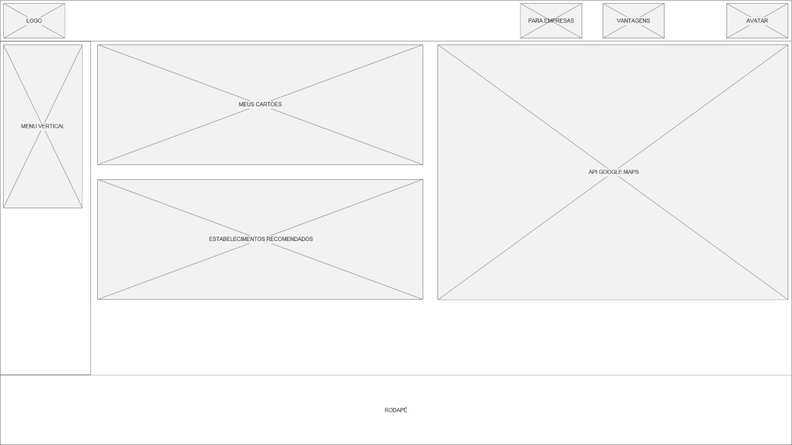

# Projeto de Interface

Pré-requisitos: <a href="2-Especificação do Projeto.md"> Documentação de Especificação</a>

Visão geral da interação do usuário pelas telas do sistema e protótipo interativo das telas com as funcionalidades que fazem parte do sistema (wireframes).

Dentre as preocupações para a montagem da interface do sistema, estamos estabelecendo foco em questões como agilidade, acessibilidade e usabilidade. Desta forma, o projeto tem uma identidade visual padronizada em todas as telas que são projetadas para funcionamento em desktops e dispositivos móveis.

## User Flow

Figura 2 - User Flow FideOn

O diagrama apresentado na figura acima mostra o fluxo de interação do usuário pelas telas do sistema. Cada uma das telas deste fluxo é detalhada na seção de Wireframes que se segue. 

## Wireframes

Conforme fluxo de telas do projeto, apresentado no item anterior, as telas do sistema são apresentadas em detalhes nos itens que se seguem. As telas do sistema apresentam uma estrutura comum. Nesta estrutura, existem 3 grandes blocos, descritos a seguir. São eles:
- **Cabeçalho**: local onde são dispostos elementos fixos de identidade (logo) e navegação principal do site (menu da aplicação);
- **Conteúdo**: apresenta o conteúdo da tela em questão;

**Tela - Home Page Responsiva - Menu de navegação na própria página**

A tela de home-page mostra os beneficios do sistema para empresas e para os clientes da empresa. Nela, temos o menu de navegação responiva, contendo a logo, informações para empresas, informações sobre os beneficios do sistema e login.

Figura 3 - Tela Home Page Responsiva

**Tela - Login**

A tela de login é uma para ambos os tipo de usuário, Empresa e Cliente da empresa. Nela, o usuário coloca suas credencias de acesso e entra na sua tela de acordo com seu tipo de usuário..

Figura 4 - Tela Login

**Tela - Usuário Empresa**

A tela do Usuário Empresa é composta por 3 blocos:
- **Cabeçalho**: onde estará os itens de navegação disponíveis para a empresa, como: Clientes, Relatórios, Ferramentas e Fale com a Fideon;
- **Conteúdo**: Contém informações importantes para o usuário Empresa.

Figura 5 - Tela Usuário Empresa

**Tela - Usuário Cliente**

A tela do Usuário Cliente é composta por 3 blocos:
- **Cabeçalho**: onde estara o nome do Usuário cliente e a navegação usuário;
- **Conteúdo**: Contém informações importantes para o usuário Cliente.

Figura 6 - Tela Usuário Cliente

