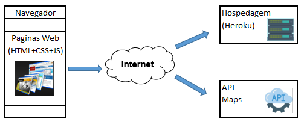

# Arquitetura da Solução

Pré-requisitos: <a href="3-Projeto de Interface.md"> Projeto de Interface</a>

Definição de como o software é estruturado em termos dos componentes que fazem parte da solução e do ambiente de hospedagem da aplicação.

## Diagrama de componentes

Diagrama que permite a modelagem física de um sistema, através da visão dos seus componentes e relacionamentos entre os mesmos.

Exemplo: 

Os componentes que fazem parte da solução são apresentados na Figura 6.

Figura 6 - Arquitetura da Solução

A solução implementada conta com os seguintes módulos:
- **Navegador** - Interface básica do sistema  
  - **Páginas Web** - Conjunto de arquivos HTML, CSS, JavaScript e imagens que implementam as funcionalidades do sistema.
- **News API** - plataforma que permite o acesso às notícias exibidas no site.
- **Hospedagem** - local na Internet onde as páginas são mantidas e acessadas pelo navegador. 

## Hospedagem

O site utiliza a plataforma do Heroku como ambiente de hospedagem do site do projeto. O site é mantido no ambiente da URL: 

[Link de exemplo](https://link_exemplo.herokuapp.com)

A publicação do site no Heroku é feita por meio de uma submissão do projeto (push) via git para o repositório remoto que se encontra no endereço: 
[Exemplo endereço](https://git.heroku.com/link_exemplo.git)
